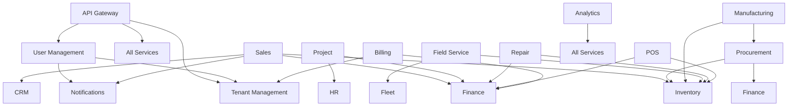

# Chiro ERP Microservices - README Summary

This document provides an overview of all microservices in the Chiro ERP system and the status of their documentation.

## 📋 Service Inventory

### 🏗️ Foundation Services

| Service                       | Port | Purpose                                        | README Status |
| ----------------------------- | ---- | ---------------------------------------------- | ------------- |
| **API Gateway**               | 8080 | Request routing, authentication, rate limiting | ✅ Complete   |
| **User Management Service**   | 8081 | Authentication, authorization, user lifecycle  | ✅ Complete   |
| **Tenant Management Service** | 8082 | Multi-tenancy, tenant configuration            | ✅ Complete   |
| **Notifications Service**     | 8088 | Multi-channel messaging, templates             | ✅ Complete   |

### 💼 Core Business Services

| Service               | Port | Purpose                                   | README Status |
| --------------------- | ---- | ----------------------------------------- | ------------- |
| **Sales Service**     | 8083 | Sales orders, quotations, pricing         | ✅ Complete   |
| **Inventory Service** | 8084 | Product catalog, stock management         | ✅ Complete   |
| **CRM Service**       | 8085 | Customer relationships, leads             | ✅ Complete   |
| **Finance Service**   | 8086 | General ledger, invoicing, payments       | ✅ Complete   |
| **Billing Service**   | 8087 | Subscription billing, revenue recognition | ✅ Complete   |

### 🏭 Operations Services

| Service                   | Port | Purpose                               | README Status |
| ------------------------- | ---- | ------------------------------------- | ------------- |
| **Procurement Service**   | 8090 | Supplier management, purchase orders  | ✅ Complete   |
| **Manufacturing Service** | 8091 | Production planning, work orders      | ✅ Complete   |
| **Project Service**       | 8092 | Project management, task tracking     | ✅ Complete   |
| **Field Service**         | 8095 | On-site services, technician dispatch | ✅ Complete   |
| **Repair Service**        | 8096 | Equipment repairs, RMA processing     | ✅ Complete   |
| **Fleet Service**         | 8094 | Vehicle management, maintenance       | ✅ Complete   |

### 👥 Support Services

| Service               | Port | Purpose                            | README Status |
| --------------------- | ---- | ---------------------------------- | ------------- |
| **HR Service**        | 8089 | Employee management, payroll       | ✅ Complete   |
| **Analytics Service** | 8093 | Business intelligence, reporting   | ✅ Complete   |
| **POS Service**       | 8097 | Point of sale, retail transactions | ✅ Complete   |

## 📊 Documentation Coverage

-   **Total Services**: 17 (including API Gateway)
-   **READMEs Created**: 17
-   **Coverage**: 100% ✅

## 📁 Documentation Structure

Each service README follows a standardized structure:

```
# Service Name
├── Overview
├── 🎯 Business Purpose
├── 🏗️ Architecture
│   ├── Domain Model
│   ├── Key Aggregates
│   └── Bounded Context
├── 🔧 Technical Specifications
│   ├── Technology Stack
│   ├── API Endpoints
│   ├── Domain Events
│   └── External Dependencies
├── 🚀 Getting Started
├── 🧪 Testing
├── 📊 Monitoring & Observability
├── 🔒 Security
├── 📚 API Documentation
├── 🚢 Deployment
├── 📋 Database Schema
├── 🤝 Contributing
└── 📞 Support
```

## 🔗 Service Dependencies

### Dependency Matrix



## 🚀 Next Steps

### Phase 0: Foundation Implementation

1. **Enhanced Build System** - Complete common-conventions.gradle.kts
2. **Service Templates** - Create service generation scripts
3. **Local Development** - Enhanced docker-compose.yml
4. **CI/CD Pipeline** - GitHub Actions workflows

### Service Implementation Priority

Based on the development plan:

#### Tier 1: Foundation (Weeks 5-7)

1. Tenant Management Service
2. User Management Service
3. Notifications Service

#### Tier 2: Business Core (Weeks 8-10)

4. Inventory Service
5. CRM Service
6. Sales Service

#### Tier 3: Supporting (Weeks 11-12)

7. Finance Service
8. Billing Service

## 📞 Support & Contacts

### Team Assignments

-   **Platform Team**: Foundation services, infrastructure, API Gateway
-   **Sales Domain Team**: Sales, CRM services
-   **Finance Domain Team**: Finance, Billing services
-   **Operations Domain Team**: Inventory, Procurement, Manufacturing, Fleet
-   **Service Domain Team**: Field Service, Repair Service
-   **HR Domain Team**: HR Service
-   **Analytics Domain Team**: Analytics Service
-   **Retail Domain Team**: POS Service

### Communication Channels

-   **General**: #chiro-erp-dev
-   **Architecture**: #architecture-decisions
-   **Platform**: #platform-team
-   **DevOps**: #devops-alerts

---

**Document Version**: 1.0.0
**Last Updated**: July 2025
**Next Review**: August 2025
