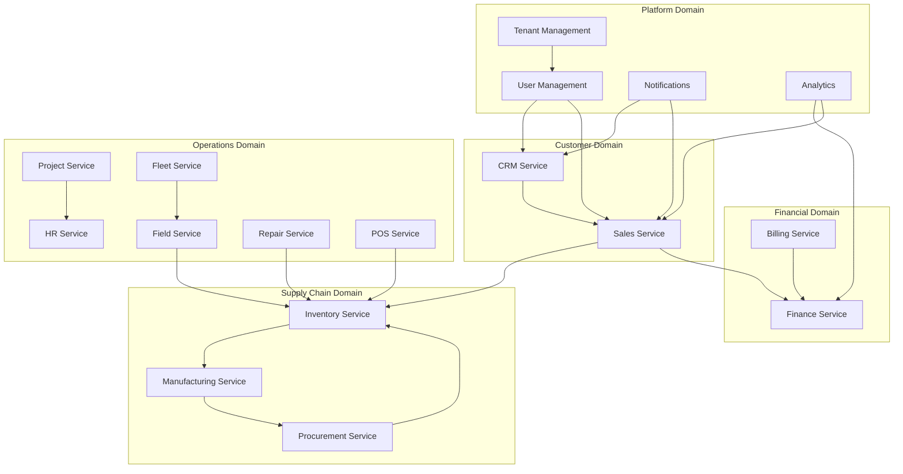

# Domain Model

## Overview

Chiro-ERP's domain model is designed using Domain-Driven Design (DDD) principles, organized into bounded contexts that represent distinct business domains within an ERP system.

## Bounded Context Map



## Domain Contexts

### 1. Customer Management Context

#### CRM Service Domain Model

```kotlin
// Aggregates
data class Lead(
    val id: LeadId,
    val tenantId: TenantId,
    val source: LeadSource,
    val contact: ContactInformation,
    val qualification: LeadQualification,
    val score: LeadScore,
    val status: LeadStatus,
    val assignedTo: UserId?,
    val activities: List<LeadActivity>
) : AggregateRoot<LeadId> {

    fun qualify(qualification: LeadQualification): Lead {
        // Domain logic for lead qualification
        return copy(
            qualification = qualification,
            score = calculateScore(qualification),
            status = if (qualification.isQualified) LeadStatus.QUALIFIED else LeadStatus.DISQUALIFIED
        )
    }

    fun convertToOpportunity(): OpportunityCreatedEvent {
        require(status == LeadStatus.QUALIFIED) { "Only qualified leads can be converted" }
        return OpportunityCreatedEvent(
            opportunityId = OpportunityId.generate(),
            leadId = id,
            tenantId = tenantId,
            contact = contact,
            estimatedValue = qualification.estimatedValue
        )
    }
}

data class Account(
    val id: AccountId,
    val tenantId: TenantId,
    val name: AccountName,
    val type: AccountType,
    val industry: Industry,
    val contacts: List<Contact>,
    val addresses: List<Address>,
    val status: AccountStatus,
    val creditLimit: Money?,
    val paymentTerms: PaymentTerms
) : AggregateRoot<AccountId>

// Value Objects
data class LeadScore(val value: Int) {
    init {
        require(value in 0..100) { "Lead score must be between 0 and 100" }
    }
}

data class ContactInformation(
    val firstName: String,
    val lastName: String,
    val email: Email,
    val phone: Phone?,
    val title: String?
)

// Domain Events
data class LeadQualifiedEvent(
    val leadId: LeadId,
    val tenantId: TenantId,
    val score: LeadScore,
    val estimatedValue: Money,
    val qualifiedBy: UserId,
    val occurredOn: Instant
) : DomainEvent
```

### 2. Sales Management Context

#### Sales Service Domain Model

```kotlin
data class SalesOrder(
    val id: SalesOrderId,
    val tenantId: TenantId,
    val customerId: CustomerId,
    val orderNumber: OrderNumber,
    val orderDate: LocalDate,
    val requestedDeliveryDate: LocalDate?,
    val items: List<OrderItem>,
    val status: OrderStatus,
    val totalAmount: Money,
    val discounts: List<Discount>,
    val paymentTerms: PaymentTerms,
    val shippingAddress: Address,
    val billingAddress: Address
) : AggregateRoot<SalesOrderId> {

    fun addItem(product: Product, quantity: Quantity, unitPrice: Money): SalesOrder {
        require(status == OrderStatus.DRAFT) { "Can only add items to draft orders" }

        val newItem = OrderItem(
            productId = product.id,
            quantity = quantity,
            unitPrice = unitPrice,
            lineAmount = quantity.value * unitPrice
        )

        val updatedItems = items + newItem
        val newTotal = calculateTotal(updatedItems, discounts)

        return copy(
            items = updatedItems,
            totalAmount = newTotal
        )
    }

    fun confirm(): List<DomainEvent> {
        require(status == OrderStatus.DRAFT) { "Only draft orders can be confirmed" }
        require(items.isNotEmpty()) { "Cannot confirm empty order" }

        val events = mutableListOf<DomainEvent>()

        // Reserve inventory for each item
        items.forEach { item ->
            events.add(
                StockReservationRequestedEvent(
                    orderId = id,
                    productId = item.productId,
                    quantity = item.quantity,
                    tenantId = tenantId
                )
            )
        }

        events.add(
            SalesOrderConfirmedEvent(
                orderId = id,
                customerId = customerId,
                totalAmount = totalAmount,
                tenantId = tenantId,
                occurredOn = Instant.now()
            )
        )

        return events
    }
}

data class SalesQuote(
    val id: QuoteId,
    val tenantId: TenantId,
    val prospectId: ProspectId,
    val quoteNumber: QuoteNumber,
    val validUntil: LocalDate,
    val items: List<QuoteItem>,
    val status: QuoteStatus,
    val totalAmount: Money,
    val terms: QuoteTerms
) : AggregateRoot<QuoteId>
```

### 3. Inventory Management Context

#### Inventory Service Domain Model

```kotlin
data class Product(
    val id: ProductId,
    val tenantId: TenantId,
    val sku: SKU,
    val name: ProductName,
    val description: String?,
    val category: ProductCategory,
    val unitOfMeasure: UnitOfMeasure,
    val specifications: ProductSpecifications,
    val variants: List<ProductVariant>,
    val status: ProductStatus,
    val pricing: PricingInformation
) : AggregateRoot<ProductId> {

    fun createVariant(
        variantSku: SKU,
        attributes: VariantAttributes
    ): ProductVariant {
        require(status == ProductStatus.ACTIVE) { "Cannot create variants for inactive products" }

        return ProductVariant(
            id = VariantId.generate(),
            parentProductId = id,
            sku = variantSku,
            attributes = attributes
        )
    }
}

data class Warehouse(
    val id: WarehouseId,
    val tenantId: TenantId,
    val code: WarehouseCode,
    val name: String,
    val address: Address,
    val locations: List<InventoryLocation>,
    val capacity: WarehouseCapacity,
    val isActive: Boolean
) : AggregateRoot<WarehouseId> {

    fun receiveStock(
        productId: ProductId,
        quantity: Quantity,
        locationId: LocationId,
        costPerUnit: Money
    ): StockMovement {
        require(isActive) { "Cannot receive stock in inactive warehouse" }

        val location = locations.find { it.id == locationId }
            ?: throw IllegalArgumentException("Location not found")

        return StockMovement(
            id = MovementId.generate(),
            warehouseId = id,
            productId = productId,
            movementType = MovementType.RECEIPT,
            quantity = quantity,
            fromLocation = null,
            toLocation = location,
            costPerUnit = costPerUnit,
            occurredOn = Instant.now()
        )
    }
}

data class StockReservation(
    val id: ReservationId,
    val tenantId: TenantId,
    val productId: ProductId,
    val warehouseId: WarehouseId,
    val quantity: Quantity,
    val reservedFor: ReservationPurpose,
    val expiresOn: Instant,
    val status: ReservationStatus
) : AggregateRoot<ReservationId>
```

### 4. Manufacturing Context

#### Manufacturing Service Domain Model

```kotlin
data class ProductionOrder(
    val id: ProductionOrderId,
    val tenantId: TenantId,
    val orderNumber: ProductionOrderNumber,
    val productId: ProductId,
    val quantityToProduce: Quantity,
    val billOfMaterialsId: BOMId,
    val workCenterId: WorkCenterId,
    val scheduledStartDate: LocalDateTime,
    val scheduledEndDate: LocalDateTime,
    val status: ProductionOrderStatus,
    val materialRequirements: List<MaterialRequirement>,
    val operations: List<ProductionOperation>
) : AggregateRoot<ProductionOrderId> {

    fun start(): List<DomainEvent> {
        require(status == ProductionOrderStatus.PLANNED) { "Can only start planned orders" }
        require(areMaterialsAvailable()) { "Required materials not available" }

        return listOf(
            ProductionOrderStartedEvent(
                orderId = id,
                productId = productId,
                quantityToProduce = quantityToProduce,
                tenantId = tenantId,
                occurredOn = Instant.now()
            ),
            MaterialConsumptionRequestedEvent(
                orderId = id,
                materialRequirements = materialRequirements,
                tenantId = tenantId
            )
        )
    }
}

data class BillOfMaterials(
    val id: BOMId,
    val tenantId: TenantId,
    val productId: ProductId,
    val version: BOMVersion,
    val components: List<BOMComponent>,
    val operations: List<RoutingOperation>,
    val isActive: Boolean,
    val effectiveFrom: LocalDate,
    val effectiveTo: LocalDate?
) : AggregateRoot<BOMId>
```

### 5. Financial Management Context

#### Finance Service Domain Model

```kotlin
data class Account(
    val id: AccountId,
    val tenantId: TenantId,
    val accountNumber: AccountNumber,
    val name: String,
    val type: AccountType,
    val category: AccountCategory,
    val balance: Money,
    val isActive: Boolean,
    val parentAccountId: AccountId?
) : AggregateRoot<AccountId>

data class JournalEntry(
    val id: JournalEntryId,
    val tenantId: TenantId,
    val entryNumber: JournalEntryNumber,
    val date: LocalDate,
    val description: String,
    val lineItems: List<JournalLineItem>,
    val totalDebit: Money,
    val totalCredit: Money,
    val status: JournalEntryStatus,
    val reference: Reference?,
    val fiscalPeriodId: FiscalPeriodId
) : AggregateRoot<JournalEntryId> {

    fun post(): JournalEntry {
        require(status == JournalEntryStatus.DRAFT) { "Only draft entries can be posted" }
        require(isBalanced()) { "Journal entry must be balanced" }

        addDomainEvent(
            JournalEntryPostedEvent(
                entryId = id,
                lineItems = lineItems,
                amount = totalDebit,
                tenantId = tenantId,
                occurredOn = Instant.now()
            )
        )

        return copy(status = JournalEntryStatus.POSTED)
    }

    private fun isBalanced(): Boolean = totalDebit == totalCredit
}
```

## Cross-Context Integration

### Domain Events

Domain events facilitate communication between bounded contexts:

```kotlin
// Event published by Sales Service
data class SalesOrderConfirmedEvent(
    val orderId: SalesOrderId,
    val customerId: CustomerId,
    val orderItems: List<OrderItem>,
    val totalAmount: Money,
    val tenantId: TenantId,
    override val occurredOn: Instant = Instant.now(),
    override val eventId: EventId = EventId.generate()
) : DomainEvent

// Handled by Inventory Service
@EventHandler
class SalesOrderEventHandler(
    private val inventoryService: InventoryService
) {

    @EventSubscriber("sales.order.confirmed")
    fun handle(event: SalesOrderConfirmedEvent) {
        event.orderItems.forEach { item ->
            inventoryService.reserveStock(
                productId = item.productId,
                quantity = item.quantity,
                reservationPurpose = ReservationPurpose.SALES_ORDER(event.orderId)
            )
        }
    }
}
```

### Shared Kernel

Common value objects and concepts shared across contexts:

```kotlin
// Shared Value Objects
data class Money(
    val amount: BigDecimal,
    val currency: Currency
) {
    operator fun plus(other: Money): Money {
        require(currency == other.currency) { "Cannot add different currencies" }
        return copy(amount = amount + other.amount)
    }
}

data class Quantity(val value: BigDecimal, val unit: UnitOfMeasure) {
    operator fun times(price: Money): Money =
        Money(value * price.amount, price.currency)
}

data class Address(
    val street: String,
    val city: String,
    val state: String,
    val postalCode: String,
    val country: Country
)

// Shared Identifiers
@JvmInline
value class TenantId(val value: UUID) : Identifier

@JvmInline
value class UserId(val value: UUID) : Identifier

@JvmInline
value class ProductId(val value: UUID) : Identifier
```

## Anti-Corruption Layers

Protection from external systems and legacy integrations:

```kotlin
// External ERP Integration
interface ExternalERPAdapter {
    fun getCustomer(externalId: String): ExternalCustomer
    fun syncOrders(since: LocalDateTime): List<ExternalOrder>
}

class ExternalERPAntiCorruptionLayer(
    private val adapter: ExternalERPAdapter,
    private val translator: ExternalDataTranslator
) {

    fun importCustomer(externalId: String): Account {
        val externalCustomer = adapter.getCustomer(externalId)
        return translator.toAccount(externalCustomer)
    }
}

class ExternalDataTranslator {
    fun toAccount(external: ExternalCustomer): Account {
        return Account(
            id = AccountId.generate(),
            tenantId = TenantId.current(),
            name = AccountName(external.companyName),
            type = mapAccountType(external.type),
            // ... other mappings
        )
    }
}
```

## Domain Services

Cross-aggregate business logic:

```kotlin
@DomainService
class PricingService(
    private val priceListRepository: PriceListRepository,
    private val discountRepository: DiscountRepository
) {

    fun calculatePrice(
        productId: ProductId,
        customerId: CustomerId,
        quantity: Quantity,
        date: LocalDate
    ): PriceCalculation {

        val basePrice = priceListRepository
            .findEffectivePrice(productId, date)
            ?: throw ProductPriceNotFound(productId)

        val applicableDiscounts = discountRepository
            .findApplicableDiscounts(customerId, productId, quantity, date)

        val totalDiscount = applicableDiscounts
            .fold(Percentage.ZERO) { acc, discount -> acc + discount.percentage }

        val finalPrice = basePrice.apply(totalDiscount)

        return PriceCalculation(
            basePrice = basePrice,
            discounts = applicableDiscounts,
            finalPrice = finalPrice
        )
    }
}
```

## Repository Patterns

Data access abstraction:

```kotlin
interface CustomerRepository : Repository<Account, AccountId> {
    fun findByTenantAndName(tenantId: TenantId, name: String): Account?
    fun findActiveCustomers(tenantId: TenantId): List<Account>
    fun findByCreditRating(rating: CreditRating): List<Account>
}

interface SalesOrderRepository : Repository<SalesOrder, SalesOrderId> {
    fun findByCustomer(customerId: CustomerId): List<SalesOrder>
    fun findPendingOrders(tenantId: TenantId): List<SalesOrder>
    fun findOrdersForPeriod(period: DateRange): List<SalesOrder>
}
```

---

_This domain model provides a solid foundation for implementing a comprehensive ERP system with clear boundaries, rich business logic, and maintainable architecture._
