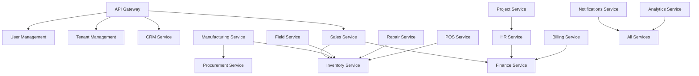

# Service Catalog

## Overview

Chiro-ERP consists of 18 microservices organized by business domain and technical capabilities. Each service follows Clean Architecture principles with Domain-Driven Design patterns.

## Core Business Services

### 1. CRM Service

**Port**: 8083 | **Database**: chiro_crm

**Purpose**: Customer Relationship Management

-   Lead management and scoring
-   Account and contact management
-   Opportunity tracking
-   Marketing campaign management
-   Customer interaction history

**Key Aggregates**:

-   `Lead` - Sales leads with scoring and conversion tracking
-   `Account` - Customer accounts with hierarchical relationships
-   `Opportunity` - Sales opportunities with pipeline management
-   `MarketingCampaign` - Marketing campaigns and effectiveness tracking

**Integration Events**:

-   `LeadCreatedEvent` - New lead entered system
-   `OpportunityWonEvent` - Opportunity closed as won
-   `CustomerCreatedEvent` - Customer account created

---

### 2. Sales Service

**Port**: 8084 | **Database**: chiro_sales

**Purpose**: Sales Order Management

-   Sales quotations and proposals
-   Order processing and fulfillment
-   Pricing management and discounts
-   Sales reporting and analytics

**Key Aggregates**:

-   `SalesOrder` - Customer orders with line items
-   `SalesQuote` - Sales quotations and proposals

**Integration Events**:

-   `OrderPlacedEvent` - Order placed by customer
-   `OrderShippedEvent` - Order dispatched for delivery
-   `QuoteAcceptedEvent` - Customer accepted quotation

---

### 3. Inventory Service

**Port**: 8085 | **Database**: chiro_inventory

**Purpose**: Stock and Warehouse Management

-   Product catalog management
-   Inventory tracking and valuation
-   Warehouse operations
-   Stock movements and adjustments

**Key Aggregates**:

-   `Product` - Product definitions with variants
-   `Warehouse` - Warehouse locations and capacity
-   `StockReservation` - Inventory reservations
-   `PhysicalInventoryCount` - Cycle counting and audits

**Integration Events**:

-   `StockLevelChangedEvent` - Inventory level updates
-   `ProductCreatedEvent` - New product added
-   `WarehouseTransferEvent` - Stock transfer between warehouses

---

### 4. Manufacturing Service

**Port**: 8086 | **Database**: chiro_manufacturing

**Purpose**: Production Management

-   Bill of Materials (BOM) management
-   Production order processing
-   Work center capacity planning
-   Material requirements planning (MRP)

**Key Aggregates**:

-   `ProductionOrder` - Manufacturing orders
-   `BillOfMaterials` - Product BOMs and routing
-   `WorkCenter` - Production facilities and capacity

**Integration Events**:

-   `ProductionOrderStartedEvent` - Production commenced
-   `ProductionCompletedEvent` - Finished goods produced
-   `MaterialConsumedEvent` - Raw materials consumed

---

### 5. Procurement Service

**Port**: 8087 | **Database**: chiro_procurement

**Purpose**: Purchase Order Management

-   Vendor management
-   Purchase requisitions and approvals
-   Purchase order processing
-   Goods receipt and vendor payments

**Key Aggregates**:

-   `PurchaseOrder` - Purchase orders to vendors
-   `PurchaseRequisition` - Internal purchase requests
-   `Vendor` - Supplier information and terms
-   `GoodsReceipt` - Received goods documentation

**Integration Events**:

-   `PurchaseOrderCreatedEvent` - PO created for vendor
-   `GoodsReceivedEvent` - Materials received from vendor
-   `VendorPaymentDueEvent` - Payment due to vendor

---

### 6. Finance Service

**Port**: 8088 | **Database**: chiro_finance

**Purpose**: Financial Management

-   General ledger and chart of accounts
-   Multi-currency support
-   Financial reporting
-   Cost accounting and budgeting

**Key Aggregates**:

-   `Account` - Chart of accounts
-   `JournalEntry` - Financial transactions
-   `LedgerAccountBalance` - Account balances
-   `FiscalPeriod` - Accounting periods

**Integration Events**:

-   `JournalEntryPostedEvent` - Financial transaction posted
-   `PeriodClosedEvent` - Accounting period closed
-   `BudgetExceededEvent` - Budget variance alert

---

### 7. Billing Service

**Port**: 8089 | **Database**: chiro_billing

**Purpose**: Invoicing and Payments

-   Invoice generation and management
-   Payment processing
-   Subscription billing
-   Dunning and collections

**Key Aggregates**:

-   `Invoice` - Customer invoices
-   `Subscription` - Recurring billing subscriptions
-   `DunningCase` - Collection processes

**Integration Events**:

-   `InvoiceGeneratedEvent` - Invoice created for customer
-   `PaymentReceivedEvent` - Customer payment processed
-   `DunningInitiatedEvent` - Collection process started

---

## Operational Services

### 8. HR Service

**Port**: 8090 | **Database**: chiro_hr

**Purpose**: Human Resources Management

-   Employee lifecycle management
-   Payroll processing
-   Performance reviews
-   Benefits administration

**Key Aggregates**:

-   `Employee` - Employee records and profiles
-   `PayrollRun` - Payroll processing batches
-   `PerformanceReview` - Employee performance evaluations

**Integration Events**:

-   `EmployeeHiredEvent` - New employee onboarded
-   `PayrollProcessedEvent` - Payroll completed
-   `PerformanceReviewCompletedEvent` - Review finished

---

### 9. Project Service

**Port**: 8091 | **Database**: chiro_project

**Purpose**: Project Management

-   Project planning and execution
-   Task management and dependencies
-   Time tracking and billing
-   Resource allocation

**Key Aggregates**:

-   `Project` - Project definitions and phases
-   `TimeSheet` - Employee time tracking

**Integration Events**:

-   `ProjectCreatedEvent` - New project initiated
-   `TaskCompletedEvent` - Project task finished
-   `TimesheetSubmittedEvent` - Employee time submitted

---

### 10. Field Service

**Port**: 8092 | **Database**: chiro_fieldservice

**Purpose**: Field Service Management

-   Service request management
-   Technician scheduling and dispatch
-   Parts management for field work
-   Maintenance contract management

**Key Aggregates**:

-   `ServiceRequest` - Customer service requests
-   `WorkOrder` - Field work assignments
-   `MaintenanceContract` - Service agreements

**Integration Events**:

-   `ServiceRequestCreatedEvent` - Service request logged
-   `WorkOrderCompletedEvent` - Field work finished
-   `PartsUsedEvent` - Parts consumed in field work

---

### 11. Repair Service

**Port**: 8093 | **Database**: chiro_repair

**Purpose**: Product Repair Management

-   Repair order processing
-   Warranty claim management
-   Parts and labor tracking
-   Return merchandise authorization

**Key Aggregates**:

-   `RepairOrder` - Product repair requests
-   `WarrantyClaim` - Warranty claim processing

**Integration Events**:

-   `RepairOrderCreatedEvent` - Repair request received
-   `RepairCompletedEvent` - Product repair finished
-   `WarrantyClaimProcessedEvent` - Warranty claim resolved

---

### 12. Fleet Service

**Port**: 8094 | **Database**: chiro_fleet

**Purpose**: Fleet Management

-   Vehicle management and tracking
-   Route optimization
-   Maintenance scheduling
-   Driver assignment and management

**Key Aggregates**:

-   `Vehicle` - Fleet vehicle information
-   `MaintenanceSchedule` - Vehicle maintenance plans
-   `Trip` - Vehicle trips and routes

**Integration Events**:

-   `VehicleMaintenanceDueEvent` - Maintenance required
-   `TripCompletedEvent` - Vehicle trip finished
-   `VehicleBreakdownEvent` - Vehicle service required

---

### 13. POS Service

**Port**: 8095 | **Database**: chiro_pos

**Purpose**: Point of Sale

-   Transaction processing
-   Payment handling
-   Inventory integration
-   Shift management and reconciliation

**Key Aggregates**:

-   `POSTransaction` - Retail transactions
-   `POSShift` - Cashier shifts and reconciliation

**Integration Events**:

-   `SaleCompletedEvent` - POS transaction finished
-   `PaymentProcessedEvent` - Payment completed
-   `ShiftClosedEvent` - Cashier shift ended

---

## Infrastructure Services

### 14. API Gateway

**Port**: 8080 | **Database**: None

**Purpose**: Entry Point and Routing

-   Request routing to microservices
-   Authentication and authorization
-   Rate limiting and throttling
-   Request/response transformation

**Responsibilities**:

-   JWT token validation
-   Service discovery integration
-   Circuit breaker implementation
-   API versioning support

---

### 15. User Management Service

**Port**: 8081 | **Database**: chiro_user_management

**Purpose**: Authentication and Authorization

-   User lifecycle management
-   Role-based access control (RBAC)
-   Permission management
-   Session management

**Key Aggregates**:

-   `User` - System users and profiles
-   `Role` - User roles and permissions

**Integration Events**:

-   `UserCreatedEvent` - New user registered
-   `UserActivatedEvent` - User account activated
-   `RoleAssignedEvent` - Role assigned to user

---

### 16. Tenant Management Service

**Port**: 8082 | **Database**: chiro_tenant_management

**Purpose**: Multi-Tenancy Support

-   Tenant provisioning and configuration
-   Feature flag management
-   Subscription management
-   Tenant-specific customizations

**Key Aggregates**:

-   `Tenant` - Tenant organizations

**Integration Events**:

-   `TenantCreatedEvent` - New tenant onboarded
-   `TenantActivatedEvent` - Tenant subscription active
-   `TenantConfigurationUpdatedEvent` - Tenant settings changed

---

### 17. Notifications Service

**Port**: 8096 | **Database**: chiro_notifications

**Purpose**: Communication Management

-   Multi-channel notifications (email, SMS, push)
-   Template management
-   Delivery tracking
-   User preference management

**Key Aggregates**:

-   `Notification` - Notification messages
-   `NotificationTemplate` - Message templates
-   `UserNotificationPreferences` - User communication preferences

**Integration Events**:

-   `NotificationSentEvent` - Message delivered
-   `NotificationFailedEvent` - Delivery failed
-   `UserPreferencesUpdatedEvent` - User updated preferences

---

### 18. Analytics Service

**Port**: 8097 | **Database**: chiro_analytics

**Purpose**: Business Intelligence

-   Data aggregation and transformation
-   Dashboard and report generation
-   Real-time analytics
-   Machine learning integration

**Responsibilities**:

-   ETL processing from operational databases
-   Real-time stream processing
-   Predictive analytics
-   Executive dashboards

---

## Service Dependencies

### High-Level Dependencies

### Inter-Service Communication Patterns

| Pattern                   | Usage              | Examples                                |
| ------------------------- | ------------------ | --------------------------------------- |
| **Synchronous (REST)**    | Real-time queries  | User authentication, Product lookup     |
| **Asynchronous (Events)** | Business workflows | Order processing, Inventory updates     |
| **Command Query (CQRS)**  | Complex reporting  | Financial reports, Analytics dashboards |

---

## Service Status & Roadmap

| Service               | Current Status       | Next Milestone          |
| --------------------- | -------------------- | ----------------------- |
| API Gateway           | 🚧 Structure Created | Implement routing logic |
| User Management       | 🚧 Structure Created | JWT authentication      |
| Tenant Management     | 🚧 Structure Created | Multi-tenant context    |
| CRM Service           | 🚧 Structure Created | Lead management API     |
| Sales Service         | 🚧 Structure Created | Order processing        |
| Inventory Service     | 🚧 Structure Created | Stock management        |
| Manufacturing Service | 🚧 Structure Created | BOM management          |
| Procurement Service   | 🚧 Structure Created | Purchase orders         |
| Finance Service       | 🚧 Structure Created | Chart of accounts       |
| Billing Service       | 🚧 Structure Created | Invoice generation      |
| HR Service            | 🚧 Structure Created | Employee management     |
| Project Service       | 🚧 Structure Created | Project planning        |
| Field Service         | 🚧 Structure Created | Service requests        |
| Repair Service        | 🚧 Structure Created | Repair orders           |
| Fleet Service         | 🚧 Structure Created | Vehicle management      |
| POS Service           | 🚧 Structure Created | Transaction processing  |
| Notifications Service | 🚧 Structure Created | Email notifications     |
| Analytics Service     | 🚧 Structure Created | Basic reporting         |

---

_Each service is designed to be independently deployable, scalable, and maintainable while integrating seamlessly with the overall system._
